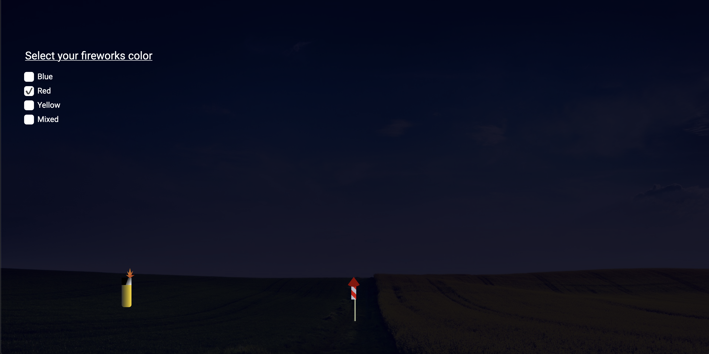
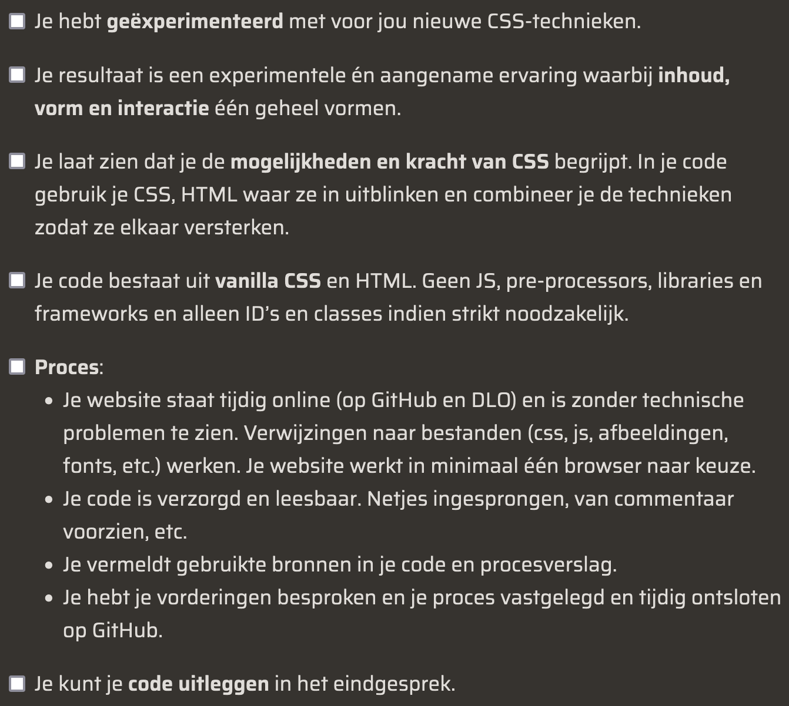

# CSS to the Rescue

Welkom bij mijn project van [CSS to the Rescue](https://github.com/cmda-minor-web/css-to-the-rescue-2122 "Google's Homepage"). Bij dit vak van de Minor 'Webdesign and development' is het de bedoeling dat we een interactieve webpagina met alleen CSS. Ik heb ervoor gekozen om hiervoor een vuurwerkshow te maken.

De website is [hier](https://tomvandenberg11.github.io/fireworks/ "Google's Homepage") te zien.

## Inhoudsopgave ✍🏼

- [Uitdaging](https://github.com/Tomvandenberg11/rijksmuseum-app#uitdaging)
- [Installatie](https://github.com/Tomvandenberg11/rijksmuseum-app#installatie)
- [To do](https://github.com/Tomvandenberg11/rijksmuseum-app#to-do)
- [Rubrics](https://github.com/Tomvandenberg11/rijksmuseum-app#rubrics)
- [Licence](https://github.com/Tomvandenberg11/rijksmuseum-app#licence)
- [Credits](https://github.com/Tomvandenberg11/rijksmuseum-app#credits)

## Uitdaging 🥵️
Mijn uitdaging hierbij is dat ik veel verschillende aanpassingen mogelijk wil make voor de gebruiker. De gebruiker kan bijvoorbeeld de kleur en het aantal vuurpijlen aanpassen door middel van checkboxes en radiobuttons. Ik verwacht dat dit een flike klus gaat worden, aangezien er geen JavaScript gebruikt mag worden.

## Installatie ⚙️

Om de app lokaal te laten draaien moet het project eerst lokaal worden gecloned.
Als dit stukje code gerunt wordt in de terminal wordt de repository lokaal gecloned:

`gh repo clone tomvandenberg11/fireworks`

Ga eerst naar de folder waarin je wilt dat het project gecloned wordt. Je kan in de terminal navigeren met `cd` met daar achter de map waar je heen wilt.

Hierna kan het bestand gewoon geopend worden in de browser door dubbel te klikken op de `index.html`.

## To do ✅

| To do                                                 | Done? |
|:------------------------------------------------------|:-----:|
| Pijl maken                                            |   ✅   |
| Reload knop                                           |   ✅   |
| Dark mode                                             |   ✅   |
| Explosie                                              |   ✅   |
| Onnodige classes, id's en  'absolute' uit het project |   ✅   |
| Rook toevoegen aan pijl                               |   ⏳   |
| Optie verschillende kleuren explosie                  |   ✅   |
| Optie meerdere vuurpijlen                             |       |

## Rubrics 🅰️

## Licence 👨🏻‍⚖️

Dit project is voorzien van een MIT licence. Zie de pagina LICENCE voor meer informatie.

## Credits 📣

Ik wil graag als eerste de docenten bedanken voor al hun inzet, uitleg en lesstof. Ten tweede wil ik mijn supportgroepje bedanken voor de mentale en functionele support. Ten derde wil ik Stackoverflow bedanken voor al hun antwoorden op mijn vragen.
